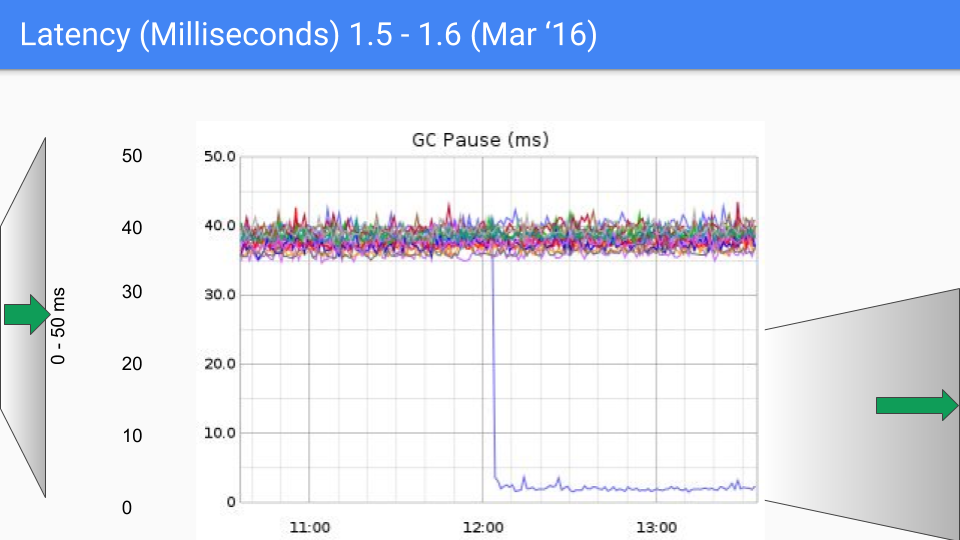
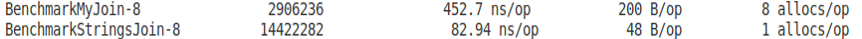
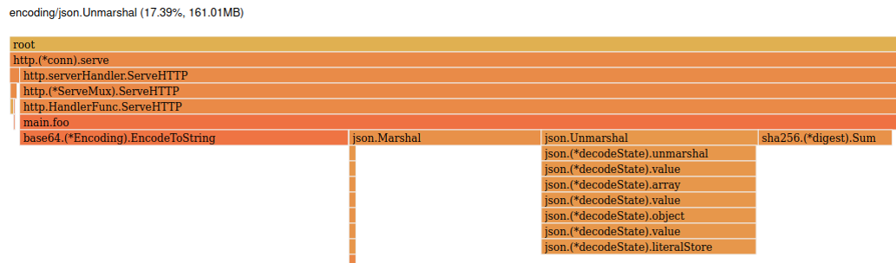

# Микрооптимизация кода на Go на примере простого веб-сервиса


Привет! Я работаю старшим Go-разработчиком в «Лаборатории Касперского». Сегодня хочу поговорить о том, как искать узкие места и оптимизировать код на Go. Разберу процесс профилирования и оптимизации на примере простого веб-сервиса - покажу, с помощью каких встроенных инструментов искать функции, активнее всего использующие CPU и память. Расскажу, какие можно применять подходы, чтобы повысить производительность. Хотя речь пойдет о микрооптимизации, в моем примере шаг за шагом производительность удалось поднять в 5 раз!

Но для начала остановимся на бенчмаркинге, garbage collector-е и еще нескольких важных особенностях языка Go с точки зрения перформанса.

## Особенности Golang

* Язык Go — компилируемый, т. е. на таргет-платформе мы запускаем нативный машинный код.
* В этом языке есть классная штука — goroutines, это «легковесные потоки», которыми управляет планировщик Go в рантайме. Благодаря им у нас нет «дорогих» системных вызовов при создании и смене контекста, а на стек горутины выделяется всего 2 КБ, тогда как для потока 1–2 МБ.
* Дополнительный бонус — поддержка указателей. Программист волен выбирать, как передать объект — по указателю или по значению.


## Производительность сборщика мусора (Garbage Collector)

В Go есть Garbage Collector (GC). С одной стороны, это удобная штука. Но посмотрим на него с точки зрения перформанса.

В 2015 году на GopherCon Рик Хадсон (Rick Hudson) представил такой слайд, заявив, что проблемы с задержками GC решены:

 

До Go 1.5 GC вносил серьезные задержки. В 2018 году тот же Рик Хадсон опубликовал историю улучшений GC в Go (https://go.dev/blog/ismmkeynote).

Переломный момент перехода с Go 1.4 на Go 1.5.




От версии к версии latency становится все меньше.


Из этого можно сделать вывод, что GC развивается. С точки зрения перформанса проблем с ним быть не должно.

## Бенчмарки

Go богат на тулинг и бенчмарки встроены прямо в язык. Они помогают оценить эффективность кода. 

Для примера возьмем задачу конкатенации строк. Представим, что мы не знаем библиотечную функцию и напишем свою реализацию. Добавим бенчмарк с помощью пакета testing. Он выглядит очень просто:

```go
func join(elems []string, sep string) string {
	var res string
	for i, s := range elems {
		res += s
		if i < len(elems)-1 {
			res += sep
		}
	}
	return res
}
```
```go
var strs = []string{
    "string a", 
    "string b", 
    "string c", 
    "string d", 
    "string e",
}

func BenchmarkMyJoin(b *testing.B) {
	for i := 0; i < b.N; i++ {
		_ = join(strs, ";")
	}
}
```

Запускаем с помощью: 

```shell
go test -bench=Join -benchmem
```
Флаг `-bench` принимает регулярное выражение. А `-benchmem` дает возможность понаблюдать за расходом памяти.

После запуска мы видим следующее:


Слева направо:

* имя бенчмарка;
* суффикс 8 — это значение GOMAXPROCS;
* количество итераций запуска бенчмарка;
* время одной операции;
* количество памяти, которое выделяется на одну операцию;
* количество аллокаций за операцию.

Сравним эти результаты с реализацией из стандартной библиотеки.

```go
func BenchmarkStrngsJoin(b *testing.B) {
	for i := 0; i < b.N; i++ {
		_ = strings.Join(strs, ";")
	}
}
```


Библиотечная реализация более чем в 5 раз эффективнее как по выделяемой памяти, так и по скорости выполнения.

### Общие рекомендации запуска бенчмарков

Обратите внимание на результаты нескольких запусков одного и того же бенчмарка. Результат может быть нестабилен, поскольку на него влияет множество факторов, например планировщик операционной системы:


Есть несколько способов стабилизировать результаты.

Можно использовать параметр `-benchtime`. 

```shell
go test -bench=. -benchtime=5s
```

С его помощью мы увеличиваем время прохождения и количество итераций бенчмарка. В результате средние значения будут стабильнее от запуска к запуску.

Следующая возможность — указать параметр `-count` и записать несколько запусков одного и того же бенчмарка в файл. 

```shell
go test -bench=. -count=10 > bench.txt
go get golang.org/x/perf/cmd/benchstat
benchstat bench.txt
```

С помощью утилиты `benchstat` от Расса Кокса (Russ Cox) данные из файла можно представить в виде среднего значения и некой дельты:


Кстати, `benchstat` удобно использовать для сравнения двух бенчмарков, например реализаций одного и того же алгоритма. Для этого запускаем два бенчмарка, сохраняем результаты в файлы, а затем сравниваем их при помощи `benchstat`.

```shell
benchstat old.txt new.txt
```


В качестве первого приближения benchstat можно использовать в continuous бенчмаркинге.

## Профайлинг в Go

В рантайм Go встроен сэмплирующий профайлер `pprof`. Это значит, что, используя pprof, мы с определенной периодичностью останавливаем работу программы и собираем метрики, в частности call-стеки. В конце делаем выводы о том, какие функции используют больше всего ресурсов, по тому, как часто они встречаются. 

pprof поможет нам ответить на следующие вопросы:

* Какие функции больше всего используют процессор? (CPU profiler)
* Кто и где выделяет память? Почему память не освобождается? (heap profiler)
* Где и сколько мы ждём на блокировках? (block/mutex profiler)
* При каких условиях операционная система создает потоки? (threadcreate)
* Как выглядят стектрейсы всех запущенных потоков? (goroutines)

### Как запускать pprof

Первый способ — с помощью `go test -bench`. Можно, например, при запуске использовать опцию `-cpuprofile`, записать результаты в файл, а затем через `go tool pprof` проанализировать данные.

```shell
go test . -bench . -cpuprofile cpu.prof
go tool pprof [binary] cpu.prof
```

Второй способ — встраивание http-хендлеров pprof прямо в приложение. Для этого мы просто импортируем `net/http/pprof`, и по роуту `http://host:port/debug/pprof` будет доступен профайлер.

```go
import _ "net/http/pprof"

func main() {
    http.ListenAndServe("localhost:8080", nil)
}
```
```shell
go tool pprof [binary] http://localhost:8080/debug/pprof/profile&seconds=5
```

Третий способ — запускать (`pprof.StartCPUProfile()`) и останавливать (`pprof.StopCPUProfile()`) профайлер прямо из кода, используя пакет `runtime/pprof`.

Рекомендую при этом использовать пакет от Дейва Чейни (Dave Cheney). Он берет на себя много рутинных операций.

```go
import "github.com/pkg/profile"

func someFunc() {
    defer profile.Start(profile.MemProfile, profile.ProfilePath(“.”)).Stop()
    ...
    // code
}
```

### Визуализация данных

Стандартный способ анализа данных профайлера — командная строка.


Если кому-то больше нравится визуализация в браузере, достаточно указать флаг `-http`.

```shell
go tool pprof -http localhost:6061
```


В браузере можно посмотреть граф — он удобнее, чем таблица в консоли.


## Сервис Foo 1.0

Переходим к примеру. Весь исходный код и историю его оптимизации можно посмотреть [тут](https://github.com/andrey-shalamov/go-pprof-cpu-heap-example). Итак, у нас есть простой веб-сервис с одним методом `/foo`:

```go
func main() {
	http.HandleFunc("/foo", foo)
	http.ListenAndServe("localhost:6060", nil)
}
```

В нём мы читаем тело запроса и unmarshal-им его в массив структур.

```go
func foo(w http.ResponseWriter, r *http.Request) {
	b, err := ioutil.ReadAll(r.Body)
	if err != nil {
		w.WriteHeader(http.StatusInternalServerError)
		return
	}
	var fooReq FooReq
	if err := json.Unmarshal(b, &fooReq); err != nil {
		w.WriteHeader(http.StatusInternalServerError)
		return
	}
    ...
}
```

Структура выглядит просто — это два поля типа string:

```go
type FooItem struct {
	StrA string `json:"srt_a"`
	StrB string `json:"str_b"`
}

type FooReq []FooItem
```

Далее мы пробегаем по каждой структуре в массиве, считаем хеш sha256 от ее полей, конвертируем в base64 и складываем в слайс:


```go
func foo(w http.ResponseWriter, r *http.Request) {
	...
	var hashes []string
	for _, foo := range fooReq {
		sha := sha256.New()
		sha.Write([]byte(foo.StrA))
		sha.Write([]byte(foo.StrB))
		hashes = append(hashes, base64.StdEncoding.EncodeToString(sha.Sum(nil)))
	}
	fooRes := FooRes{Hashes: hashes}
    ...
}
```

Полученный слайс хешей складываем в структуру ответа, marshal-им в json и пишем в тело ответа.

```go
func foo(w http.ResponseWriter, r *http.Request) {
	...
	fooRes := FooRes{Hashes: hashes}
    b, err = json.Marshal(fooRes)
	if err != nil {
		w.WriteHeader(http.StatusInternalServerError)
		return
	}
	w.Write(b)
}

type FooRes struct {
	Hashes []string `json:"hashes"`
}
```

По сути, пример просто считает хеш от полей структуры. Интересно, как быстро этот веб-сервис будет обрабатывать запросы клиента?

Для теста я взял утилиту hey (https://github.com/rakyll/hey). В принципе, можно было взять любую другую, например широко известный ApacheBench. Также я заранее подготовил текстовый файл с данными запроса, в который сложил несколько сотен объектов нужного типа.

Запускаем наш сервис и натравливаем на него утилиту:

```shell
hey -n 10000 -c 1 -m GET -D foo_req.json http://localhost:6060/foo
```

Здесь параметр `-n` — это количество запросов, а `-c` — количество goroutine, из которых мы будем их отправлять.

Рассмотрим две ситуации:
в первой (как в строке выше) отправим последовательно десять тысяч запросов (параметр `-c` равен 1);
во второй будем эмулировать конкурентные запросы к сервису из 30 goroutines. 

```shell
hey -n 10000 -c 1 -m GET -D foo_req.json http://localhost:6060/foo

Summary:
  Total:  22.0089 secs
  Slowest:  0.1363 secs
  Fastest:  0.0014 secs
  Average:  0.0022 secs
  Requests/sec:  454.3617
```

```shell
hey -n 10000 -c 30 -m GET -D foo_req.json http://localhost:6060/foo

Summary:
  Total:  9.1658 secs
  Slowest:  0.2334 secs
  Fastest:  0.0014 secs
  Average:  0.0267 secs
  Requests/sec:  1089.9231
```

Для первого кейса сервер выдает 450 rps, для второго — 1090 rps. Много это или мало, сказать сложно. Но представим, что нам нужно оптимизировать наш сервис.

### Foo 1.0 CPU profiling

В этом примере можно весь код поместить в бенчмарк и уже на нем профилировать. Я рекомендую, когда это возможно, именно так и поступать. Однако для примера представим, что в сервисе много кода и мы не знаем, что именно профилировать. В этом случае придется профилировать на проде, предварительно предусмотрев соответствующие «ручки». Натравим на наш сервис утилиту hey и подключаем профайлер:

```shell
hey -n 10000 -c 1 -m GET -D foo_req.json http://localhost:6060/foo
```

```shell
go tool pprof /path/to/binary http://localhost:6060/debug/pprof/profile?seconds=10 
```

Параметр seconds=10 означает, что мы будем собирать профиль в течение 10 секунд.

Воспользуемся командой `top`, которая покажет функции, активнее всего использующие CPU. 


Для каждой функции у нас есть:

* flat — время, которое мы проводим в данной функции, исключая вложенные;
* cum — кумулятивное значение: сколько мы проводим времени в этой функции, включая вложенные.

На вершине списка у нас:

* runtime.futex — 18%;
* syscall.yscall — 18%;
* runtime.tgkill — 7%.

А основа нашего сервиса, подсчет sha256, — это только 4%.

С первого взгляда кажется, что в медленной работе приложения виноват рантайм Go и syscall-ы. Но давайте отсортируем список по кумулятивному значению (флаг `-cum`):


Здесь видно, что большую часть времени мы проводим в функции `main.foo`. При этом 35% времени мы находимся в функции стандартного пакета `json.Unmarshal`. 

На этом этапе уже можно сказать, что мы нашли виновника медленной работы сервиса, и начать с этим разбираться. Но предлагаю зайти еще с другой стороны.

Запускаем профайлер с флагом `-http`, чтобы посмотреть еще одно удобное представление — флейм-граф.

```shell
go tool pprof -http :8080 /path/to/binary /path/to/pprof.data
```


Сверху вниз здесь глубина стека, а ширина столбца отражает кумулятивное значение времени (сколько времени мы находимся в этой функции, включая все вложенные). В этом представлении также бросается в глаза, что большую часть времени мы проводим в функции `json.Unmarshal`. Дополнительно хочу обратить внимание на правую часть графа — здесь тоже достаточно широкие столбцы и они не связаны с нашей функцией `foo`.


Видно, что функция `runtime.gcBgMarkWorker` отбирает у нас 11,5% CPU. И на вершине стека как раз `runtime.tgkill`, который был на третьем месте в топе.


По названию функции понятно, что это GC в бэкграунде маркирует память. И это интересный момент. Ранее мы говорили о том, что с GC в Go все хорошо, тем не менее на него уходит значительная часть ресурсов. К слову, тот же Рик Хадсон предупреждал, что GC может использовать до 25% CPU.

Почему в этом случае GC потребляет так много ресурсов? Очевидно, он нагружен, поскольку мы аллоцируем много памяти. Пришло время воспользоваться heap-профайлером.

## Foo 1.0 Heap profiling

Опция `-alloc_space` позволяет посмотреть все выделения памяти (включая те, что уже очищены).

```shell
go tool pprof -alloc_space http://localhost:6060/debug/pprof/heap?seconds=10
```

Если же мы хотим посмотреть аллоцированную, но еще не освобожденную память, можно воспользоваться опциями `-inuse_space` или `-inuse_object`.

Посмотрим на `top` функций:


На функцию io.ReadAll приходится больше половины всей выделенной памяти.

Но прежде чем смотреть, почему так происходит, напомню, что профайлер heap тоже сэмплирующий — он снимает профиль каждые 512 КБ выделенной памяти. Этот параметр можно регулировать — и это будет полезно, если необходимо отследить мелкие выделения памяти. Однако для нашего случая подойдет и стандартное значение.

Смотрим в код io.ReadAll. Для этого воспользуемся методом weblist. Если list отображает код в консоли, то weblist продемонстрирует его в браузере.

```shell
weblist io.ReadAll
```


Очевидно, что в методе ReadAll идет создание и наполнение слайса. Здесь видно, насколько много мы аллоцируем. То же самое мы можем посмотреть на флейм-графе.


## Шаг 1 — используем sync.Pool (Foo 1.1)

Благодаря профилированию мы знаем, что оптимизировать. Чтобы сократить количество аллокаций, воспользуемся `sync.Pool`.

```go
var bufPool = sync.Pool{
	New: func() interface{} {
		return bytes.NewBuffer(make([]byte, 0, 1024))
	},
}
```
Наш пул будет создавать буферы с capacity 1 КБ.

```go
func foo(w http.ResponseWriter, r *http.Request) {
	buf := bufPool.Get().(*bytes.Buffer)
	defer func() {
		buf.Reset()
		bufPool.Put(buf)
	}()
	_, err := io.Copy(buf, r.Body)
    ...
}
```

Получаем буфер из пула, используем его в методе `io.Copy` и перед возвращением обратно в пул не забываем сбросить буфер, вызвав Reset.

Проверяем результат:

```shell
hey -n 10000 -c 1
```
| Было, rps  | Стало, rps |
|------|-------|
| 454.3617 | **475.6389** |

Мы получили небольшой прирост производительности для последовательных запросов. Кажется, должно быть значительно больше.

У нас сократилось количество выделенной памяти — было 1672 МБ, осталось всего 265 МБ. 


Но функция io.Copy продолжает выделять достаточно много памяти, хотя, кажется, не должна этого делать. 


Второй кейс — запуск 10000 конкурентных запросов из 30 goroutines.

```shell
hey -n 10000 -c 30
```

И здесь прирост значительный.

| Было, rps  | Стало, rps |
|------|-------|
| 1089.9231 | **1488.8684** |

Почему так? Разобраться в ситуации поможет документация по sync.Pool (https://golang.org/pkg/sync/#Pool).

> Pool's purpose is to cache allocated but unused items for later reuse, **relieving pressure on the garbage collector**. That is, it makes it easy to build efficient, thread-safe free lists. **However, it is not suitable for all free lists.** Any item stored in the Pool **may be removed automatically at any time** without notification. If the Pool holds the only reference when this happens, the item might be deallocated.”

Мы используем sync.Pool, чтобы снять нагрузку с GC. Но буферы sync.Pool могут быть удалены тем же GC. В итоге мы пытаемся облегчить жизнь GC, а он продолжает удалять из пула, так что мы заново аллоцируем память.

## Шаг 2 — увеличиваем буфер (Foo 1.2)

Первое, что можно попробовать — увеличить объем изначального буфера. Один раз выделим память и будем ей пользоваться. Чтобы функция io.Copy больше не выделяла память.

```go
var bufPool = sync.Pool{
	New: func() interface{} {
		return bytes.NewBuffer(make([]byte, 0, 1024*1024))
	},
}
```

Проверяем результат.
Получаем хороший прирост при конкурентных запросах и деградацию при последовательных.

| Тест               | Было, rps | Стало, rps    |
|--------------------|-----------|---------------|
| hey -n 10000 -c 1  | 475.6389  | *438.9253*    |
| hey -n 10000 -c 30 | 1488.8684 | **2278.3559** |

Это происходит, потому что GC успевает переиспользовать буфер из sync.Pool для конкурентных запросов, и на этом получается прирост. А для последовательных запросов GC подчищает за нами намного чаще, поэтому мы каждый раз заново аллоцируем сверх необходимого объема памяти.

Можно ли что-то сделать, чтобы прирост производительности был в обоих случаях?

## Шаг 3 — FreeList (Foo 1.3)

Напишем свой FreeList — на Go это сделать очень легко. Все что нам нужно это канал и оператор select.

```go
type BufFreeList struct {
	ch chan *bytes.Buffer
}

func (p *BufFreeList) Get() *bytes.Buffer {
	select {
	case b := <-p.ch:
		return b
	default:
		return bytes.NewBuffer(make([]byte, 0, 1024*1024))
	}
}

func (p *BufFreeList) Put(b *bytes.Buffer) {
	select {
	case p.ch <- b: // ok
	default: // drop
	}
}
```

В методе Get мы читаем из канала, а если не получилось, создаём новый буфер. В методе Put мы складываем буфер в канал или дропаем его. Также у нас есть функция инициализации, где мы задаём вместимость буферизованного канала по количеству ядер процессора:

```go
func NewBufFreeList(max int) *BufFreeList {
	c := make(chan *bytes.Buffer, max)
	for i := 0; i < max; i++ {
		c <- bytes.NewBuffer(make([]byte, 0, 1024*1024))
	}
	return &BufFreeList{ch: c}
}

var bufFreeList = NewBufFreeList(runtime.NumCPU())
```

Посмотрим, что из этого получилось:

| Тест               | Было, rps | Стало, rps    |
|--------------------|-----------|---------------|
| hey -n 10000 -c 1  | 438.9253  | **571.0069**  |
| hey -n 10000 -c 30 | 2278.3559 | **2406.8540** |

Теперь мы имеем значительный прирост как для последовательных, так и для конкурентных запросов.

## Шаг 4 - Heap profiling

Продолжаем профилировать. Теперь в топе json.Unmarshal.


И здесь мы применяем тот же подход - пишем FreeList (код такой же, поэтому подробно останавливаться на нем не буду).

```go
type FooReq []FooItem

type FooReqFreeList struct {
	ch chan *FooReq
}

func (p *FooReqFreeList) Get() *FooReq {
	select {
	case b := <-p.ch:
		return b
	default:
		fooReq := FooReq(make([]FooItem, 0, 100))
		return &fooReq
	}
}

func (p *FooReqFreeList) Put(fooReq *FooReq) {
	fooReqSlace := (*fooReq)[:0]
	select {
	case p.ch <- &fooReqSlace: // ok
	default: // drop
	}
}
```

Проверяем:

| Тест               | Было, rps | Стало, rps    |
|--------------------|-----------|---------------|
| hey -n 10000 -c 1  | 571.0069  | **589.6130**  |
| hey -n 10000 -c 30 | 2406.8540 | **2483.3692** |

Мы получили небольшой прирост, но главное, сократили аллокации памяти - было 877 МБ, осталось всего 161. На флейм-графе столбец json.Unmarshal значительно сократился.



## Шаг 5 - Foo 1.4

Теперь в лидерах base64.EncodeToString, а также память почему-то выделяет sha256.Sum. Посмотрим код:


По сути, это создание слайса байт, вызов энкодера и конвертация слайса байт в строку. Заметим, что эта операция связана с выделением памяти.

А вот метод sha256.Sum.


Из кода понятно, что достаточно передавать валидный слайс (нужного объема), чтобы память не аллоцировалась.

Приступим к оптимизации следующего участка кода. 

```go
var hashes []string
for _, foo := range *fooReq {
	sha := sha256.New()
	sha.Write([]byte(foo.StrA))
	sha.Write([]byte(foo.StrB))
	hashes = append(hashes, base64.StdEncoding.EncodeToString(sha.Sum(nil)))
}
```

Приведём его к виду:

```go
// сразу аллоцируем необходимую память.
hashes := make([]string, 0, len(*fooReq))

// для sha256 мы определим массив на стеке с фиксированной длиной и будем его использовать - т.е. выделения памяти в Heap здесь вообще не будет.
var sha256Buf [sha256.Size]byte

// вместо того чтобы каждый раз в цикле создавать sha256, создадим его один раз, а в цикле будем вызывать метод Reset.
sha := sha256.New()

// заранее подготовим буфер для base64
encodedLen := base64.StdEncoding.EncodedLen(sha256.Size)
buf.Reset()
buf.Grow(encodedLen)
for i := 0; i < encodedLen; i++ {
	buf.WriteByte(0)
}

for _, foo := range *fooReq {
	sha.Reset()
	sha.Write([]byte(foo.StrA))
	sha.Write([]byte(foo.StrB))

	// используем преаллоцированные буферы
	base64.StdEncoding.Encode(buf.Bytes(), sha.Sum(sha256Buf[:0]))

	hashes = append(hashes, buf.String())
}
```

Проверяем и видим, что удалось еще немного выиграть

| Тест               | Было, rps | Стало, rps    |
|--------------------|-----------|---------------|
| hey -n 10000 -c 1  | 589.6130  | **596.2832**  |
| hey -n 10000 -c 30 | 2483.3692 | **2536.7017** |

# Шаг 6 - Heap profiling и вредный совет по оптимизации (Foo 1.5)

Опять посмотрим на данные Heap профайлера:

```shell
   45.35MB    45.35MB    115:   hashes := make([]string, 0, len(*fooReq))
         .          .    116:   var sha256Buf [sha256.Size]byte
         .          .    117:   sha := sha256.New()
         .          .    118:   encodedLen := base64.StdEncoding.EncodedLen(sha256.Size)
         .          .    119:   buf.Reset()
         .          .    120:   buf.Grow(encodedLen)
         .          .    121:   for i := 0; i < encodedLen; i++ {
         .          .    122:           buf.WriteByte(0)
         .          .    123:   }
         .          .    124:   for _, foo := range *fooReq {
         .          .    125:           sha.Reset()
         .          .    126:           sha.Write([]byte(foo.StrA))
  225.51MB   225.51MB    127:           sha.Write([]byte(foo.StrB))
         .          .    128:           base64.StdEncoding.Encode(buf.Bytes(), sha.Sum(sha256Buf[:0]))
         .   149.51MB    129:           hashes = append(hashes, buf.String())
         .          .    130:   }
```
Мы выделяем память при записи в sha256 и при вызове метода buf.String(). Чтобы понять, почему так происходит, можно заглянуть в данные дизассемблера. Здесь необязательно все понимать, достаточно просто найти такие строки:

```shell
        .          .     65ac99: MOVQ 0x80(SP), CX
  225.51MB   225.51MB    65aca1: CALL runtime.stringtoslicebyte(SB)      ;main.foo main.go:127
		.          .     65aca6: MOVQ CX, DI 
```

```shell
         .          .     65ad9f: NOPL
  149.51MB   149.51MB     65ada0: CALL runtime.slicebytetostring(SB)      ;main.foo buffer.go:65
         .          .     65ada5: MOVQ 0x60(SP), CX 
```

Выделение памяти происходит в runtime.sringtoslicebyte и в обратной операции - при конвертации из слайса байт в строку. Есть способ оптимизировать это, но он из разряда вредных советов. Без острой необходимости так делать не стоит.

Посмотрим как выглядят структуры слайса и строки в рантайме Go:

```go
type String struct {
	Data unsafe.Pointer
	Len  int
}
```
```go
type Slice struct {
	Data unsafe.Pointer
	Len  int
	Cap  int
}
```
Два первых поля у них совпадают. Это даёт возможность просто преобразовать одну структуру в другую, воспользовавшись пакетом unsafe.

```go
func bytesToString(b []byte) string {
	return *(*string)(unsafe.Pointer(&b))
}

func stringToBytes(s *string) []byte {
	return *(*[]byte)(unsafe.Pointer(s))
}
```

Тут есть некоторое ограничение. В случае bytesToString это валидная операция только если мы воспользуемся строкой до изменения буфера, на который она ссылается, т.е. нам не подходит этот метод, а в случае stringToByte возвращаемые слайсы можно использовать только на чтение, так как параметр capacity не будет проинициализирован. Это можно было бы разрешить с помощью пакета reflect, но в нашем случае обойдемся без него:

```go
for _, foo := range *fooReq {
		sha.Reset()
		sha.Write(stringToBytes(&foo.StrA))
		sha.Write(stringToBytes(&foo.StrB))
		base64.StdEncoding.Encode(buf.Bytes(), sha.Sum(sha256Buf[:0]))
		hashes = append(hashes, buf.String())
	}
```

Проверим, что получилось.

| Тест               | Было, rps | Стало, rps    |
|--------------------|-----------|---------------|
| hey -n 10000 -c 1  | 596.2832  | **609.2315**  |
| hey -n 10000 -c 30 | 2536.7017 | **2583.3775** |

Мы получили прирост по rps в обоих случаях.
Проверяем потребление памяти:

```shell
         .          .    115:
   68.53MB    68.53MB    116:   hashes := make([]string, 0, len(*fooReq))
         .          .    117:   var sha256Buf [sha256.Size]byte
         .          .    118:   sha := sha256.New()
         .          .    119:   encodedLen := base64.StdEncoding.EncodedLen(sha256.Size)
         .          .    120:   buf.Reset()
         .          .    121:   buf.Grow(encodedLen)
         .          .    122:   for i := 0; i < encodedLen; i++ {
         .          .    123:           buf.WriteByte(0)
         .          .    124:   }
         .          .    125:   for _, foo := range *fooReq {
         .          .    126:           sha.Reset()
         .          .    127:           sha.Write(stringToBytes(&foo.StrA))
         .          .    128:           sha.Write(stringToBytes(&foo.StrB))
         .          .    129:           base64.StdEncoding.Encode(buf.Bytes(), sha.Sum(sha256Buf[:0]))
         .   149.51MB    130:           hashes = append(hashes, buf.String())
         .          .    131:   }
         .          .    132:
         .          .    133:   fooRes := FooRes{Hashes: hashes}
         .          .    134:
         .   157.63MB    135:   b, err := json.Marshal(fooRes)
         .          .    136:   if err != nil {
         .          .    137:           w.WriteHeader(http.StatusInternalServerError)
         .          .    138:           return
         .          .    139:   }
         .          .    140:   w.Write(b)
```

## Шаг 7 - Heap profiling и пакет easyjson (Foo 1.6)

Теперь json.Marshal больше всех выделяет памяти.


На флейм-графе CPU профайлера json.Unmarshal тоже занимает лидирующую позицию.


Все-таки это очень требовательный к ресурсам стандартный пакет (по большей части из-за того, что он использует пакет reflect). В качестве альтернативы можно взять пакет от ребят из Mail.ru. Вместо рефлексии он использует генерацию кода маршалинга.

Получение пакета:

```shell
go get -u github.com/mailru/easyjson/…
```

Данный тег необходимо указать для структуры

```go
// easyjson:json
```

Запуск генератора

```shell
easyjson types.go
```

Для использования этого пакета достаточно в коде json заменить на easyjson:

```go
if err := easyjson.Unmarshal(buf.Bytes(), fooReq); err != nil {
	w.WriteHeader(http.StatusInternalServerError)
	return
}
```
```go
b, err := easyjson.Marshal(fooRes)
```

Проверяем результат:

| Тест               | Было, rps | Стало, rps    |
|--------------------|-----------|---------------|
| hey -n 10000 -c 1  | 616.7721  | **1145.6503** |
| hey -n 10000 -c 30 | 2618.8195 | **5129.6624** |

Замена обеспечила нам прирост почти в два раза. Сверяем его с флейм-графом по CPU:


Здесь видно, что easyjson отъедает гораздо меньше CPU.
В лидерах осталась основа сервиса - sha256, чтение из сокета и запись ответа в сокет - базовые операции.
На этом можно остановиться и подвести итоги.

## Итоги

Мы ускорили наш сервис почти в 5 раз для конкурентных запросов. 

| Тест               | Было, rps | Стало, rps    |
|--------------------|-----------|---------------|
| hey -n 10000 -c 1  | 454.3617  | **1145.6503** |
| hey -n 10000 -c 30 | 1089.9231 | **5129.6624** |


Пример в статье — это микрооптимизация, которая помогает, когда в целом у нас все хорошо, но нужно еще что-то выжать. Кстати, если вы хотите приложить руку к подобным изысканиям и знакомы со спецификой высоконагруженных систем, приходите в нашу команду. Мы разрабатываем не только на Go, но и на Rust и C++. Тут явно пригодятся знания в области архитектуры современных процессоров и памяти, опыт работы с БД и познания в ядре Linux. Но зато есть, где применить энтузиазм, — мы создаем действительно неординарные вещи (актуальные вакансии есть тут: http://careers.kaspersky.ru/tech/go/?utm_source=specialprojects&utm_medium=habr_blog&utm_campaign=go_optimisation). 

Если же вы хотите создавать высокопроизводительные системы на Go, рекомендую в первую очередь прорабатывать архитектуру - выбирать правильные инструменты и технические средства, а потом выжимать максимум, начиная с оптимизации использования памяти.
